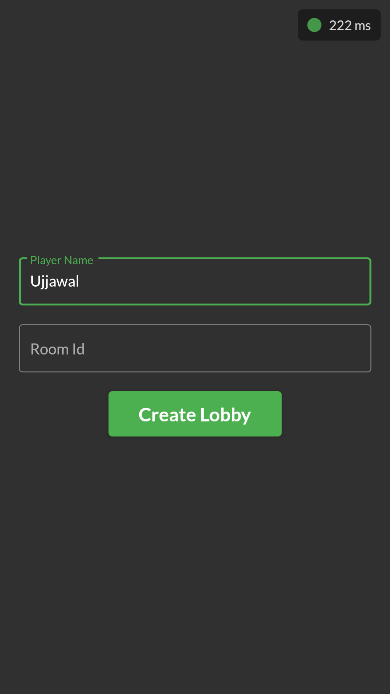
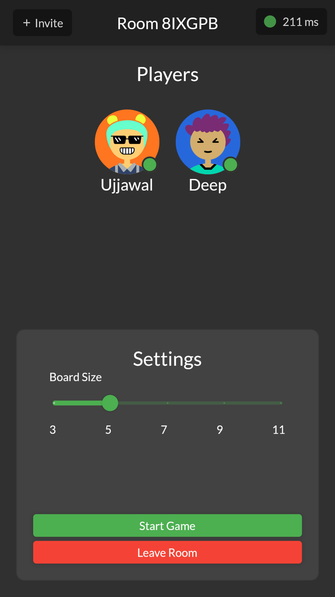
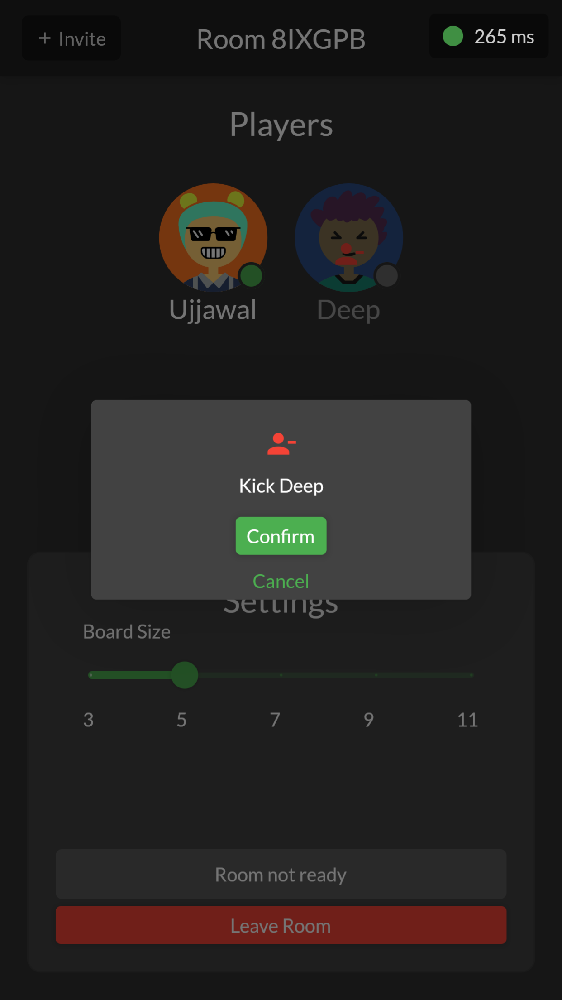
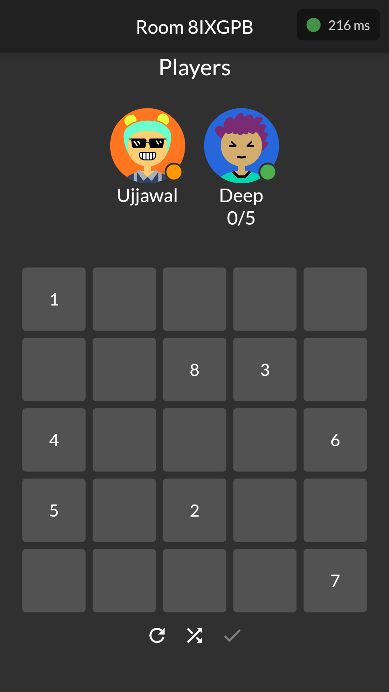
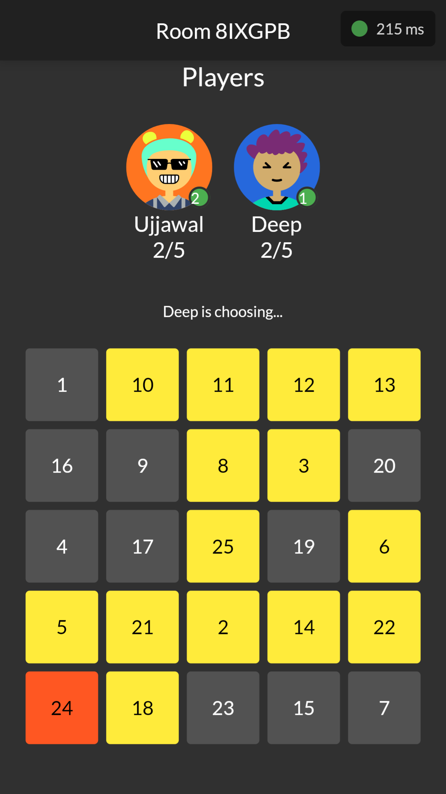
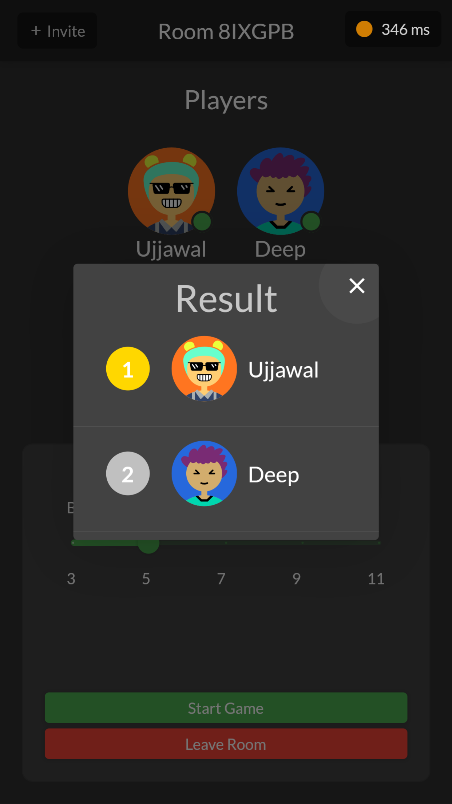

<h2 align="center"><b>Bingo Tingo</b></h2>

<h4 align="center">A multiplayer web game to play with your friends!</h4>

 

 

## Screenshots

 

## Overview

BingoTingo is a modern, web-based multiplayer gaming platform that brings classic games like Bingo and Lines & Boxes to life with real-time interaction. Built with Flutter for the frontend and Rust for the backend, it offers a seamless and responsive gaming experience across devices.

## Features

- **Multiple Games**: Play Bingo or Lines & Boxes in the same app.
- **Room Creation**: Easily create or join game rooms.
- **Real-Time Multiplayer**: Play games with friends or strangers in real-time.
- **Live Chat**: Communicate with other players through the built-in chat feature.
- **Cross-Platform**: Access the game on any device with a web browser.
- **Responsive Design**: Enjoy a consistent experience on desktop or mobile.

## Technical Stack

- **Frontend**: Flutter Web for a smooth, app-like experience in the browser.
- **Backend**: Rust for high-performance server-side logic.
- **API**: GraphQL over WebSocket subscriptions for efficient, real-time data exchange.

## How It Works

1. Create or join a game room.
2. Choose between Bingo or Lines & Boxes.
3. Play the game in real-time with other participants.
4. Chat and interact with players during the game.
5. Enjoy automatic scoring and game progression.

## Game Modes

### Bingo
- Classic number-calling Bingo game.
- Customizable card sizes and winning patterns.
- Automatic number calling and win detection.

### Lines & Boxes
- Strategic game of completing squares on a grid.
- Various grid sizes available.
- Real-time updates as players make moves.

## Key Advantages

- **Seamless Multiplayer**: Real-time updates ensure all players are in sync.
- **Low Latency**: Rust backend and WebSocket communication for quick responses.
- **Flexible Platform**: Play on any device with a modern web browser.
- **Social Gaming**: Built-in chat fosters a community feel.

## Additional Features

- **Game History**: Review past games and scores.
- **Customizable Avatars**: Personalize your gaming profile.
- **Leaderboards**: Compare scores with other players.
- **Spectator Mode**: Watch ongoing games without participating.

Experience the joy of classic board games in a modern, multiplayer setting with BingoTingo - where fun meets technology!

## License

Bingo Tingo is Free Software: You can use, study share and improve it at your
will. Specifically you can redistribute and/or modify it under the terms of the
[GNU General Public License](https://www.gnu.org/licenses/gpl.html) as
published by the Free Software Foundation, either version 3 of the License, or
(at your option) any later version.
